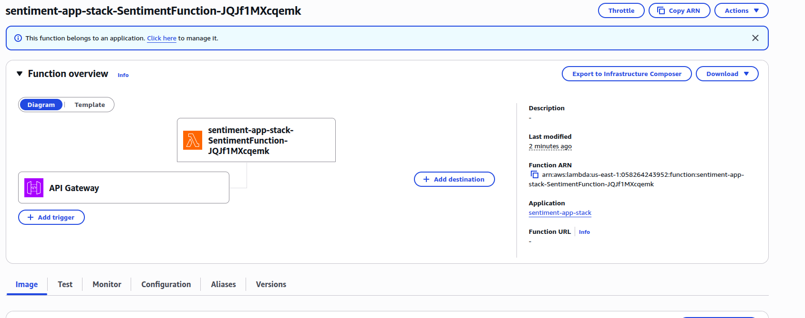
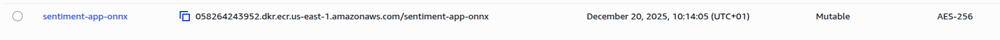
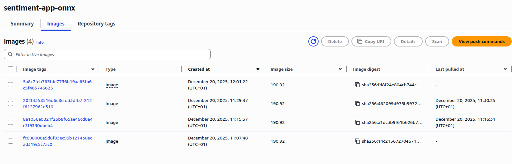
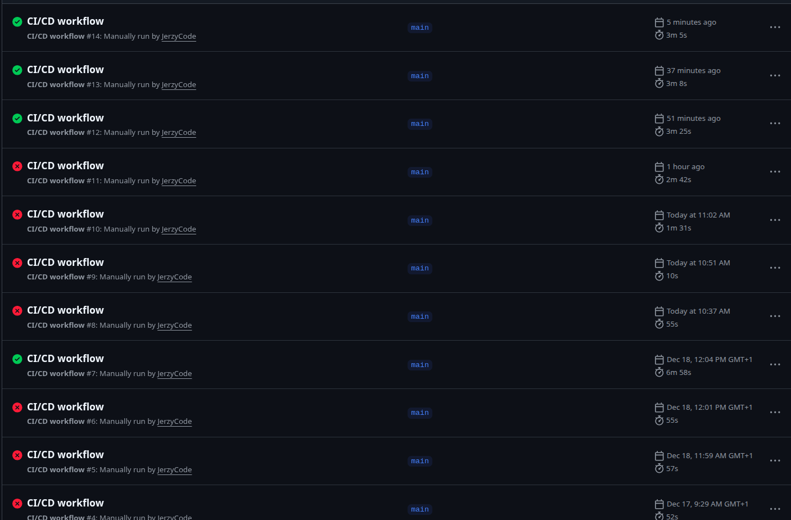

# Labolatory

## Exercise 1

Visible in the pyproject.toml file.


## Exercise 2

After road of debugging, the successful pipeline workflow is under the url: https://github.com/JerzyCode/mlops_lab11/actions/runs/20334824691/job/58418696901


## Exercise 3


- added helper scripts
- refactored app
- refactored Dockerfiles

- builded docker dev image

```bash
jerzy-boksa@jerzyb-laptop:~/Programming/Projects/university/term_3/mlops_lab11$ docker image ls
IMAGE                                         ID             DISK USAGE   CONTENT SIZE   EXTRA
sentiment-onnx:latest                         fa8faeb2cde9        623MB        189MB        
```

Noticed the massive reduction of the size. Previous docker image had 1.33GB size.

Application has starded successfully.


## Exercise 4


- added secrets to github
- created ECR repository
- added steps to the workflow.yaml
- added mangum for aws lambda
- added sam-template.yaml and other steps in deployment
- debugging and fixing
- successfully done




```bash
jerzy-boksa@jerzyb-laptop:~$ curl -X POST https://ue686irphd.execute-api.us-east-1.amazonaws.com/predict \  
    -H "Content-Type: application/json" \
    -d '{"text": "MLOps is amazing!"}'

{"prediction":"positive"}
```


# Homework

## Exercise 1

- added neccessary modifications for the ci_cd_workflow.yaml

## Exercise 2

- Added ECR



- Created secret keys


- steps are already implemented in workflow file.


Image tags:




github sha: 5a8c7feb763fde7736b19aa65fb6c5f463746625
image tag: 5a8c7feb763fde7736b19aa65fb6c5f463746625


## Lab and Homework workflow history

